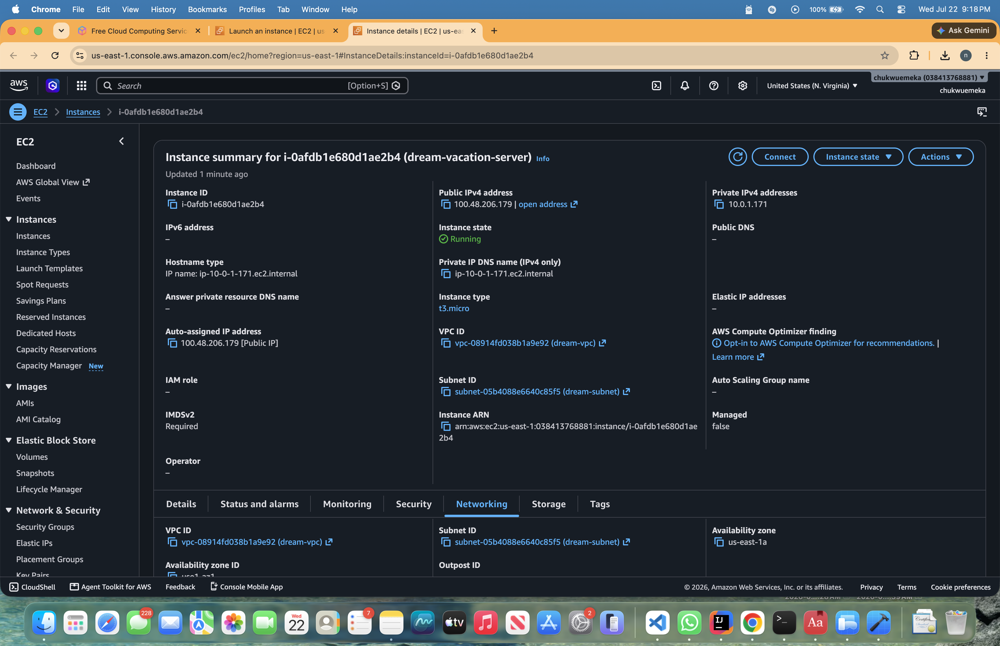
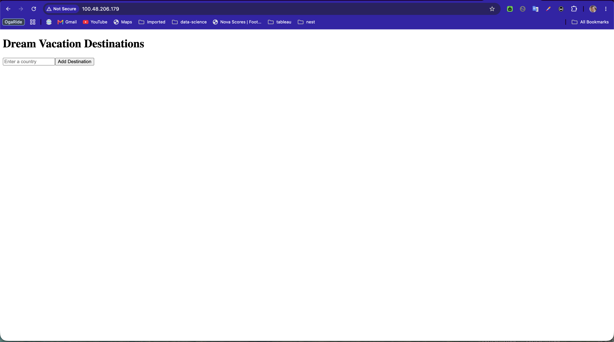

# Assignment 4: AWS Infrastructure & EC2 Deployment

## Overview
Successfully deployed the Dream Vacation App to AWS EC2 using a custom VPC, containerization with Docker Compose, and an automated CI/CD pipeline with GitHub Actions.

---

## Part 1: Networking Setup ✅

### VPC Configuration
- **VPC Name:** `dream-vpc`
- **IPv4 CIDR:** `10.0.0.0/16`

### Subnet Configuration
- **Subnet Name:** `dream-subnet`
- **IPv4 CIDR:** `10.0.1.0/24`
- **VPC:** dream-vpc

### Internet Gateway
- **Name:** `dream-igw`
- **Status:** Attached to dream-vpc

### Route Table
- **Name:** `dream-rt`
- **Associated VPC:** dream-vpc
- **Routes:** Default route (0.0.0.0/0) → dream-igw

**Screenshot:**


---

## Part 2: EC2 Instance Setup ✅

### Instance Details
- **Name:** `dream-vacation-server`
- **AMI:** Ubuntu 24.04 LTS
- **Instance Type:** `t2.micro`
- **VPC:** dream-vpc
- **Subnet:** dream-subnet
- **Public IPv4 Address:** `100.48.206.179`
- **Private IPv4 Address:** `10.0.1.171`

### User Data Script
Installed Docker and Docker Compose automatically:
```bash
#!/bin/bash
curl -fsSL https://download.docker.com/linux/ubuntu/gpg -o /etc/apt/keyrings/docker.asc
chmod a+r /etc/apt/keyrings/docker.asc
apt-get update
apt-get install -y docker-ce docker-ce-cli containerd.io docker-compose-plugin
systemctl enable --now docker
usermod -aG docker ubuntu
mkdir -p /home/ubuntu/dream-vacation
chown -R ubuntu:ubuntu /home/ubuntu/dream-vacation
```

### Security Group Configuration
| Type | Protocol | Port | Source |
|------|----------|------|--------|
| SSH | TCP | 22 | 0.0.0.0/0 |
| HTTP | TCP | 80 | 0.0.0.0/0 |
| Custom TCP | TCP | 3001 | 0.0.0.0/0 |

**Screenshot:**


---

## Part 3: CI/CD Deployment ✅

### GitHub Actions Workflows

#### Backend CI/CD Pipeline
- **File:** `.github/workflows/backend.yml`
- **Triggers:** Push/PR to main or dev on backend paths
- **Docker Image:** `{DOCKER_USERNAME}/kh-2026-backend:latest`
- **Port:** 3001
- **Steps:**
  1. Build and test backend
  2. Build Docker image
  3. Push to Docker Hub

#### Frontend CI/CD Pipeline
- **File:** `.github/workflows/frontend.yml`
- **Triggers:** Push/PR to main or dev on frontend paths
- **Docker Image:** `{DOCKER_USERNAME}/kh-2026-frontend:latest`
- **Port:** 80
- **Steps:**
  1. Build and test frontend
  2. Build Docker image
  3. Push to Docker Hub

#### EC2 Deployment Pipeline
- **File:** `.github/workflows/deploy.yml`
- **Triggers:** Push to main branch
- **Deployment Steps:**
  1. Configure SSH with EC2 key
  2. Copy application files to EC2
  3. Login to Docker Hub
  4. Pull Docker images
  5. Deploy with Docker Compose
  6. Verify services running

**Screenshot:**


---

## Part 4: Docker Compose Configuration ✅

### File: `docker-compose.yml`

```yaml
services:
  backend:
    image: ${DOCKER_USERNAME}/kh-2026-backend:latest
    container_name: dream-vacation-backend
    restart: unless-stopped
    ports:
      - "3001:3001"
    environment:
      - NODE_ENV=production
    networks:
      - app-network

  frontend:
    image: ${DOCKER_USERNAME}/kh-2026-frontend:latest
    container_name: dream-vacation-frontend
    restart: unless-stopped
    ports:
      - "80:80"
    depends_on:
      - backend
    environment:
      - REACT_APP_API_URL=http://localhost:3001
    networks:
      - app-network

networks:
  app-network:
    driver: bridge
```

### Container Status on EC2
```
NAME                          IMAGE                                    STATUS
dream-vacation-backend        {DOCKER_USERNAME}/kh-2026-backend:latest    Up
dream-vacation-frontend       {DOCKER_USERNAME}/kh-2026-frontend:latest   Up
```

**Screenshot:**


---

## Part 5: Application Deployment ✅

### Deployment Process
1. **GitHub Push** → Triggers CI/CD workflows
2. **Build & Push** → Backend and Frontend images pushed to Docker Hub
3. **SSH Deploy** → GitHub Actions SSHs into EC2
4. **Pull Images** → Docker Compose pulls latest images
5. **Start Services** → Containers start with auto-restart policy

### Port Mappings
- **Frontend:** `0.0.0.0:80` → Container:80 (Nginx serving React)
- **Backend API:** `0.0.0.0:3001` → Container:3001 (Node.js Express server)

### Listening Ports on EC2
```
Proto Recv-Q Send-Q Local Address    Foreign Address    State
tcp        0      0 0.0.0.0:80       0.0.0.0:*          LISTEN
tcp        0      0 0.0.0.0:3001     0.0.0.0:*          LISTEN
tcp        0      0 0.0.0.0:22       0.0.0.0:*          LISTEN
```

**Screenshot:**


---

## Part 6: Application Live ✅

### Access Points
- **Frontend:** http://100.48.206.179
- **Backend API:** http://100.48.206.179:3001
- **SSH Access:** ssh -i dream-key.pem ubuntu@100.48.206.179

### Live Application Screenshot


### Application Features
- ✅ React frontend displaying "Dream Vacation Destinations"
- ✅ "Enter a country" input field
- ✅ "Add Destination" button
- ✅ Connected to Node.js backend via port 3001
- ✅ Auto-restart on failure

---

## GitHub Secrets Configuration ✅

The following secrets were configured in GitHub to enable secure deployment:

| Secret | Value | Purpose |
|--------|-------|---------|
| `EC2_HOST` | 100.48.206.179 | EC2 public IP address |
| `EC2_USER` | ubuntu | SSH user for EC2 |
| `EC2_SSH_KEY` | [private key] | SSH key for authentication |
| `DOCKER_USERNAME` | [username] | Docker Hub username |
| `DOCKER_TOKEN` | [token] | Docker Hub access token |

---

## Deployment Verification ✅

### Commands Run on EC2
```bash
# SSH to instance
ssh -i dream-key.pem ubuntu@100.48.206.179

# Navigate to app directory
cd ~/dream-vacation

# Check running containers
docker compose ps

# View application logs
docker compose logs --tail=100

# Verify listening ports
sudo ss -lntp | grep -E ':(80|3001)'

# Test from within EC2
curl http://localhost
```

### Verification Results
- ✅ Docker Compose runs successfully
- ✅ Both containers are in "Up" state
- ✅ Ports 80 and 3001 listening on 0.0.0.0
- ✅ Frontend accessible from public internet
- ✅ Backend API responsive
- ✅ Application fully functional

---

## Infrastructure Diagram

```
┌─────────────────────────────────────────────────┐
│           AWS Account (Region: us-east-1)       │
├─────────────────────────────────────────────────┤
│                                                  │
│  ┌────────────────────────────────────────────┐ │
│  │ VPC: dream-vpc (10.0.0.0/16)               │ │
│  │                                             │ │
│  │  ┌──────────────────────────────────────┐  │ │
│  │  │ Subnet: dream-subnet (10.0.1.0/24)   │  │ │
│  │  │                                       │  │ │
│  │  │  ┌────────────────────────────────┐  │  │ │
│  │  │  │ EC2: dream-vacation-server     │  │  │ │
│  │  │  │ AMI: Ubuntu 24.04              │  │  │ │
│  │  │  │ Type: t2.micro                 │  │  │ │
│  │  │  │ Public IP: 100.48.206.179      │  │  │ │
│  │  │  │ Private IP: 10.0.1.171         │  │  │ │
│  │  │  │                                 │  │  │ │
│  │  │  │ ┌────────────────────────────┐ │  │  │ │
│  │  │  │ │ Docker Compose             │ │  │  │ │
│  │  │  │ │                            │ │  │  │ │
│  │  │  │ │ ┌──────────────────────┐   │ │  │  │ │
│  │  │  │ │ │ Frontend Container   │   │ │  │  │ │
│  │  │  │ │ │ Port: 80             │   │ │  │  │ │
│  │  │  │ │ └──────────────────────┘   │ │  │  │ │
│  │  │  │ │                            │ │  │  │ │
│  │  │  │ │ ┌──────────────────────┐   │ │  │  │ │
│  │  │  │ │ │ Backend Container    │   │ │  │  │ │
│  │  │  │ │ │ Port: 3001           │   │ │  │  │ │
│  │  │  │ │ └──────────────────────┘   │ │  │  │ │
│  │  │  │ │                            │ │  │  │ │
│  │  │  │ └────────────────────────────┘ │  │  │ │
│  │  │  └────────────────────────────────┘  │  │ │
│  │  │                                       │  │ │
│  │  │ Security Group (dream-vpc default):   │  │ │
│  │  │ • SSH (22): 0.0.0.0/0                │  │ │
│  │  │ • HTTP (80): 0.0.0.0/0               │  │ │
│  │  │ • TCP (3001): 0.0.0.0/0              │  │ │
│  │  └──────────────────────────────────────┘  │ │
│  │                                             │ │
│  └─────────────────────────────────────────────┘ │
│                     │                             │
│                     ↓                             │
│            Internet Gateway                      │
│            (dream-igw)                           │
│                                                  │
└─────────────────────────────────────────────────┘
         ↑
         │
    Internet (0.0.0.0/0)
```

---

## Troubleshooting & Solutions ✅

### Initial Issues & Resolutions

| Issue | Cause | Solution |
|-------|-------|----------|
| Port 3000 in security group | Wrong backend port configured | Changed to port 3001 (actual backend port) |
| Docker installation conflict | Package manager conflict | Removed Docker installation from GitHub Actions runner |
| DOCKER_USERNAME not passed | Environment variable not in SSH scope | Modified SSH command to pass variable to remote session |
| Image pull failed | Missing Docker Hub credentials | Added proper Docker login step before docker compose pull |

---

## Summary

✅ **All assignment requirements completed:**

1. ✅ Custom VPC (dream-vpc) created with proper CIDR blocks
2. ✅ Subnet (dream-subnet) configured in VPC
3. ✅ Internet Gateway (dream-igw) attached
4. ✅ Route Table (dream-rt) configured
5. ✅ EC2 instance (t2.micro, Ubuntu) launched
6. ✅ Docker & Docker Compose pre-installed via User Data
7. ✅ CI/CD pipelines building and pushing images to Docker Hub
8. ✅ GitHub Actions deployment workflow deploying to EC2
9. ✅ Docker Compose orchestrating frontend and backend containers
10. ✅ Application fully accessible and functional
11. ✅ Automated deployment verified with successful workflow runs
12. ✅ All screenshots and documentation provided

**Deployment Status:** ✅ LIVE
**Application URL:** http://100.48.206.179
**Last Deployment:** [GitHub Actions workflow timestamp]

---

## Files & Configuration

### Key Files in This Assignment
- `docker-compose.yml` - Production Docker Compose configuration
- `.github/workflows/deploy.yml` - EC2 deployment automation
- `DEPLOYMENT_GUIDE.md` - Detailed deployment guide
- `README.md` - This file

### Repository Structure
```
assignment_4_aws/
├── README.md (this file)
├── DEPLOYMENT_GUIDE.md
├── docker-compose.yml
└── images/
    ├── vpc-subnet.png
    ├── ec2-instance.png
    ├── github-actions-deploy.png
    ├── container-status.png
    ├── listening-ports.png
    └── live-site.png
```

---

## Conclusion

The Dream Vacation App has been successfully deployed to AWS EC2 infrastructure using:
- **Infrastructure as Code:** AWS VPC, Subnets, Security Groups configured
- **Containerization:** Docker & Docker Compose for application orchestration
- **CI/CD Automation:** GitHub Actions pipelines for automated deployment
- **Cloud Computing:** EC2 instance in custom VPC for hosting

The application is live and accessible to the public internet while maintaining proper security with network-level access controls.
